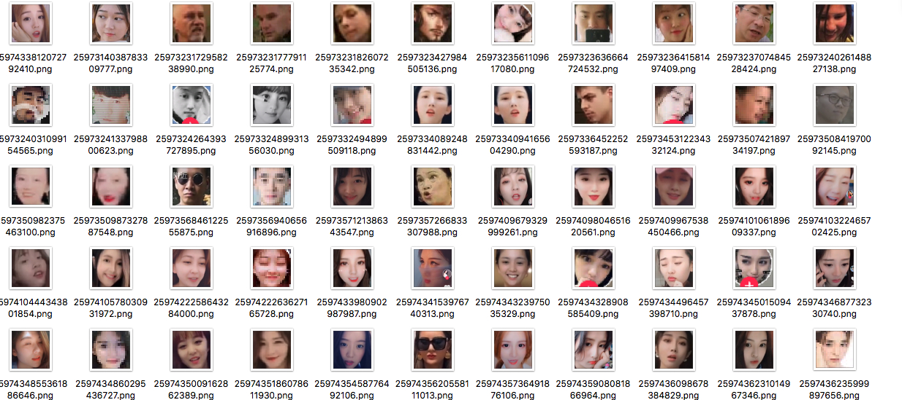

# 如何在抖音上找到漂亮小姐姐----抖音机器人

       

最近沉迷于抖音无法自拔，常常花好几个小时在抖音**漂亮小姐姐**身上。

本着**高效、直接**地找到漂亮小姐姐的核心思想，我用 Python + ADB 做了一个 Python 抖音机器人 Douyin-Bot。

 
    
##  特性

- [x] **自动翻页**
- [x] **颜值检测**
- [x] **人脸识别**
- [x] **自动点赞**
- [x] **自动关注**
- [x] **随机防Ban**
- [x] **自动评论**

## 原理

- 打开《抖音短视频》APP，进入主界面
- 获取手机截图，并对截图进行压缩 (Size < 1MB)；
- 请求 [人脸识别 API](http://ai.qq.com/)；
- 解析返回的人脸 Json 信息，对人脸检测切割；
- 当颜值大于门限值 `BEAUTY_THRESHOLD`时，点赞并关注；
- 下一页，返回第一步；

## 使用教程

- Python版本：3.0及以上
- 在 [ai.qq.com](https://ai.qq.com) 免费申请 `AppKey` 和 `AppID`（项目中已自带）
1. 获取源码：`git clone https://github.com/wangshub/Douyin-Bot.git`
2. 进入源码目录： `cd Douyin-Bot`
3. 安装依赖： `pip install -r requirements.txt`
4. 运行程序：`python douyin-bot.py`
5. [自动评论](https://zhuanlan.zhihu.com/p/57242891)(可选)：`python3 douyin-bot.py --reply`

## 注意

- 目前暂时只适配了分辨率`1920x1080`和`2340x1080`，如果手机不是该分辨率，请修改 `config/` 文件夹下面的配置文件；
- `config.json`配置文件参考：
    - `center_point`: 屏幕中心点`(x, y)`，区域范围 `rx, ry`
    - `follow_bottom`: 关注按钮位置`(x, y)`，区域范围 `rx, ry`
    - `star_bottom`: 点赞按钮位置`(x, y)`，区域范围 `rx, ry`
    

## 脸部截取

## LICENSE

欢迎 Star 和 Fork ~

如果你有什么问题请提 Issue，或者关注我的微信公众号留言，我都会一一解答

